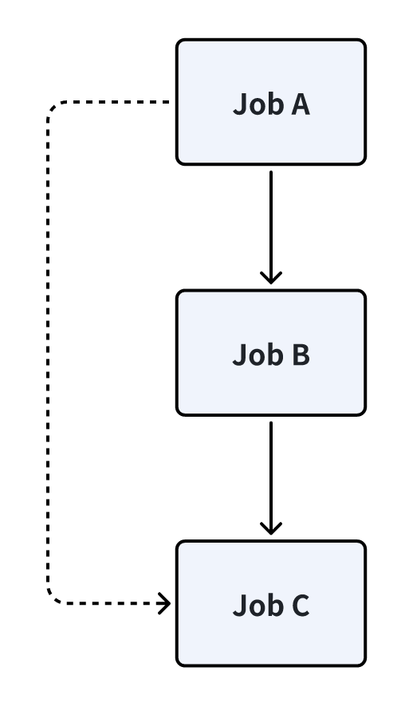

# 编译 batchjobs 依赖图

## 相关 policy

### 1. build.fence

对于 proto target / codgen target 而言，它们会通过代码生成 *.h 头文件，而依赖它们的 target 启动编译需要这些头文件。假设 target A 依赖一个 proto target B，那么我们会在 proto target B 上将 `build.fence` 设置为 true，从而令 target A 的 `before_build` job 等待 proto target B 的 `after_build` job 运行完后再执行。

> 例子可见: example/rules/protobuf.cpp/xmake.lua

### 2. build.across_targets_in_parallel

设置了 `build.across_targets_in_parallel` 为 false 后，它会限制父 target 和它的所有依赖的子 target 的并行度，这意味对于父 target 为 root的子依赖图，假设任意一个其中的 target A 依赖 target B，那么 target A 的 `before_build` job 会等待 target B 的 `after_build` job 运行，导致 CPU 利用率较低。

> 默认是开启的，目前没有必要关闭，所以不用关心。

### 3. build.high_priority

想象一种场景，在大型项目中，有一个编译时间很长（假设编译时间是 x）的 A.cc 文件。由于 cc 文件的编译独立性，我们可以将这个 A.cc 前置编译独占一个核，从而提高 CPU 利用率。假设剩余的其他 cc 文件总的编译时间是 y，那么最终的编译时间是 `std::max(x, y)`。

> 例子可见：example/policy/build.high_priority/xmake.lua

## batchjobs graph 构建流程

以 `example/rules/protobuf.cpp/xmake.lua` 的 `foo.proto` target 为例。

### 1. "${target_name}/after_build"

首先添加 `foo.proto/after_build`，它的主要逻辑是：

* 先运行 target 的 `target:after_build` 脚本
* 再**按顺序**遍历所有的 rules，执行 `rule:after_build`，没有的话再执行 `rule:after_buildcmd`

### 2. "${target_name}/link"

对于 object target 而言是 "${target_name}/fakelink"，在这个例子中即 `foo.proto/fakelink`，会执行链接操作，但是 object target 是空的。

### 3. build sourcebatch groups

调用 `rule_groups.build_sourcebatch_groups(target, sourcebatches)` 构造 sourcebatch groups。这一步主要是为了处理一些有依赖关系的 rule，group 深度代表依赖树的深度，在我们这个场景没有任何需要依赖的 rule 信息，所以 depth 为 1。

> <https://github.com/xmake-io/xmake/issues/2814>

groups 大致的格式如下：

```json
[
    {
        "protobuf.cpp" : {
            "rule": "table()",
            "target": "table()",
            "sourcebatch": {
                "rulename": "protobuf.cpp",
                "sourcefiles": [
                    "foo/proto/header.proto"
                ],
            }
        }
    }
]
```

处理完后要 reverse groups 保证最终的运行顺序。

### 4. add batchjobs for groups

遍历所有的 groups，添加如下 batchjobs：

* `"${target_name}/after_build_files${group_idx}"`
* `"${target_name}/build_files${group_idx}"`
* `"${target_name}/before_build_files${group_idx}"`

对于我们这个具体的 target 它会先添加 `foo.proto/build_files1` group，具体逻辑是遍历所有的 proto 文件，添加一个以 proto 文件名命名的 batchjob（此场景是 `foo/proto/header.proto`）：

> 我们特地用 `on_build_file` 来 override 掉 `on_buildcmd_file`，因为这样可以复用 ccache 以及更多 object target 的编译逻辑。

```lua
-- add batch jobs for the custom rule
function _add_batchjobs_for_rule(batchjobs, rootjob, target, sourcebatch, suffix)

    ...

    -- add batch jobs for xx_build_file
    if not script then
        scriptname = "build_file" .. (suffix and ("_" .. suffix) or "")
        script = ruleinst:script(scriptname)
        if script then
            local sourcekind = sourcebatch.sourcekind
            for _, sourcefile in ipairs(sourcebatch.sourcefiles) do
                batchjobs:addjob(sourcefile, function (index, total, opt)
                    script(target, sourcefile, {sourcekind = sourcekind, progress = opt.progress})
                end, {rootjob = rootjob, distcc = ruleinst:extraconf(scriptname, "distcc")})
            end
        end
    end

    ...

end
```

继续添加 `foo.proto/before_build_files1` group，由于 `protobuf.cpp` rule 有 `before_build_files` 脚本（而且是 batch 模式的），因此会执行调用 `before_build_file` 脚本来修改 batchjobs：

```lua
-- add batch jobs for the custom rule
function _add_batchjobs_for_rule(batchjobs, rootjob, target, sourcebatch, suffix)

    ...

    -- add batch jobs for xx_build_files
    local scriptname = "build_files" .. (suffix and ("_" .. suffix) or "")
    local script = ruleinst:script(scriptname)
    if script then
        if ruleinst:extraconf(scriptname, "batch") then
            script(target, batchjobs, sourcebatch, {rootjob = rootjob, distcc = ruleinst:extraconf(scriptname, "distcc")})
        else

            ...

        end
    end

    ...

end
```

定义在 `protobuf.cpp` rule：

```lua
rule("protobuf.cpp", function()

    ...

    before_build_files(function (target, batchjobs, sourcebatch, opt)
        import("proto").build_cxfiles(target, batchjobs, sourcebatch, opt, "cxx")
    end, {batch = true})

    ...

end)
```

而这个脚本会构造一个 nodes 侵入到 batchjobs 里，注意这些所有新增加的 job 都在 `foo.proto/before_build_files1` 里。

```lua
-- build batch jobs
function build_cxfiles(target, batchjobs, sourcebatch, opt, sourcekind)
    opt = opt or {}
    local nodes = {}
    local nodenames = {}
    local node_rulename = "rules/" .. sourcebatch.rulename .. "/node"
    local sourcefiles = sourcebatch.sourcefiles
    for _, sourcefile_proto in ipairs(sourcefiles) do
        local nodename = node_rulename .. "/" .. sourcefile_proto
        nodes[nodename] = {
            name = nodename,
            job = batchjobs:addjob(nodename, function(index, total, jobopt)
                local batchcmds_ = batchcmds.new({target = target})
                -- *.proto file ==> *.pb.h and *.pb.cc file
                buildcmd_pfiles(target, batchcmds_, sourcefile_proto, {progress = jobopt.progress}, sourcekind)
                batchcmds_:runcmds({changed = target:is_rebuilt(), dryrun = option.get("dry-run")})
            end)
        }
        table.insert(nodenames, nodename)

        local cxfile_nodename = nodename .. "/" .. sourcekind
        nodes[cxfile_nodename] = {
            name = cxfile_nodename,
            deps = {nodename},
            job = batchjobs:addjob(cxfile_nodename, function(index, total, jobopt)
                -- *.pb.cc file ==> object file
                build_cxfile(target, sourcefile_proto, {progress = jobopt.progress}, sourcekind)
            end)
        }
        table.insert(nodenames, cxfile_nodename)
    end
    buildjobs(nodes, batchjobs, opt.rootjob)
end
```

### 5. "${target_name}/before_build"

它的执行逻辑是：

* 先运行 `target:before_build` 脚本
* 遍历所有的 rule 先运行 `rule:before_build`，没有的话再运行 `rule:before_buildcmd`

对于 `protobuf.cpp` rule 而言这一块没什么逻辑。

## 细节

### 1. non-object target 的依赖补丁

由于我们让 target 尽可能地并行，即默认都令 `build.across_targets_in_parallel` 为 true，再通过 `build.fence` 做强制依赖。这时候可能会丢失 `build.fence` target 的间接依赖关系导致报错。

因此我们对于所有的 non-object-target，在构造完 batchjobs 后强制令它的 `before_build` 任务依赖它的所有直接和间接依赖的 target 的 `after_build` 任务。

```lua
-- make sure static/shared/binary target waits until all of it's direct and indirect
-- dependent `after_build` tasks are compiled
for _, target in ipairs(project.ordertargets()) do
    local target_kind = target:kind()
    local non_object_kind = target_kind == "static" or target_kind == "shared" or target_kind == "binary"
    local visited_deps = {}
    if non_object_kind then
        local root_job = build_jobs[target:name()]
        if root_job then
            _add_batchjobs_for_non_object_target(batchjobs, target, root_job, build_after_jobs, visited_deps)
        end
    end
end
```

以 `example/policy/build.across_targets_in_parallel/xmake.lua` 为例，假设 binary target A 依赖 object target B，而 B 又依赖 static target C。那么我们必须保证 A 的 `link` job 必须在 C 的 `link` job 后，否则可能出现 bug。

我们在构造了一棵尽可能并行的树后，对于非 object target，让它们的 `link` job 必须强制直接和间接依赖的 `after_build` job 完成。最终其依赖图如下所示：


### 2. build fence

前面提到了 `build.fence` policy，对于 proto target / codgen target 而言，依赖他们的 target 需要等到 `*.h / *.hpp` 文件生成后才能触发编译。因此我们通过 `build.fence` policy 来构建编译屏障。

```lua
target("foo.proto", function()
    set_kind("object")

    add_files("foo/proto/*.proto", { proto_public = true, proto_rootdir = "foo"})
    add_rules("protobuf.cpp")
    add_packages("protobuf-cpp")
    set_policy('build.fence', true)  -- target `main` 会等到 target foo.proto 编译完后才触发编译
end)

target("main", function()
    set_kind("binary")
    add_files("main.cc")
    add_deps("foo.proto")
end)
```


### 3. 依赖图剪枝

构造依赖图是通过 `xmake/modules/private/async/jobpool.lua` 实现的，它主要提供的添加依赖关系的接口是：

```lua
-- add job to the given job node
--
-- @param job       the job
-- @param rootjob   the root job node (optional)
--
function jobpool:add(job, rootjob)
    ...
end
```

从 root 节点出发逐渐添加完全部的 target，之后我们还会根据前面提到的 policy 增加 / 改变依赖关系，可能会出现冗余的依赖关系。

举个例子，假设 Job A 依赖 Job B 和 Job C，而且 Job B 也依赖 Job C，那么 Job A 依赖 Job C 就是一个冗余依赖，也就是虚线部分，我们应该对齐剪枝。简单描述一下，就是如果两个 Job 之间同时存在直接依赖和简洁依赖关系，那么应该剔除掉间接依赖关系。

> 以我们的一个大型代码库为例，它共有 400+ targets，其中 300 个是单测 binary target，如果运行 `xmake b --dry-run --all` 空跑的话需要 20 秒以上，因此对依赖图剪枝就有一定的必要性。



### 4. buildcmd_file 和 build_file 的区别

`buildcmd_file` 主要用于 project generator，也可以支持 xmake 运行构建。但是它的缺点在于无法融入 batchjobs 做并发编译。

`build_file` 会直接添加到 batchjobs 中从而支持并发编译提高构建速度，而且一旦配置了 `build_file` 就会优先使用它，没配置的话再 fallback 到 `buildcmd_file`。

目前对于 protobuf rule 同时配置了 `buildcmd_file` 和 `build_file`，运行构建的时候 `build_file` 会覆盖 `buildcmd_file`，project generator 会直接使用 `buildcmd_file`，原因在于：

* `build_file` 可以提高构建速度
* `buildcmd_file` 可以生成 `compile_commands.json` 用于代码跳转

对于这种 codegen rule 同时都写的还是比较麻烦，后续再研究一下能否统一。
