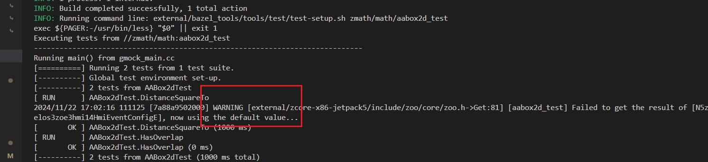

# softlink installdir

## 背景

xmake 在 package 中通过 FILE 宏打日志时，如果是头文件会导致 FILE 对应的路径是绝对路径，从而导致日志很长。

原因在于 xmake 用了 -I 绝对路径，但是即使是换成相对路径估计也很长，而且没法复用 ccache。


bazel 创建了软链，会显得相对路径简短很多：




## 设计

首先新增一个 `package.enable_softlink_installdir` policy，默认所有的 required-package（即 top level）都开启软链功能。注意只包含通过 `add_packages `直接引入的 package（即 top-level package），而不包含间接 package，原因在于现在不太好处理。

软链链接路径是 `build/.pkg/${pkg_name}`。

在 xrepo 中（即 XMAKE_IN_REPO 环境变量为 1 时）我们会关闭 package softlink installdir 这个功能以减少不确定性。但是对于 `is_source_embed` 我们是不关闭这个功能的，一方面是因为 local package 是比较可控的，另一方面是如果关闭了会导致编译参数改变从而无法命中 ccache。在 `https://github.com/TOMO-CAT/xmake/issues/149` 中我们有相关的讨论。

### 1. 创建软链

创建软链的逻辑在 `xmake/actions/config/main.lua` 中：

```lua
function main(opt)
        if project.policy("package.enable_softlink_installdir") then
            -- after install xrepo packages, we will call `os.tryrm()` to delete `package:data("cleanable_sourcedir")`,
            -- and deleting the sourcedir will remove the installdir of the dependent packages that
            -- are symlibked in `${sourcedir}/build/.pkg`, so we choose not to create softlink in XREPO
            if not os.getenv("XMAKE_IN_XREPO") then
                -- mkdir a softlink to all packages' installdir to avoid using absolute paths with the __FILE__ macro
                -- @see https://github.com/TOMO-CAT/xmake/issues/62
                local requires = project.required_packages()
                if requires then
                    for requirename, require in pairs(requires) do
                        local pkg_softlink_installdir = path.join(config.buildir(), ".pkg", requirename)
                        local pkg_installdir = path.absolute(require:installdir())
                        -- when we `add_requires("zlib")` in a project, require:installdir() may be nil
                        -- this may be because this library is a system library
                        if pkg_installdir then
                            -- remove previous softlink to force update the symbolic link of package installdir
                            os.rm(pkg_softlink_installdir)
                            os.ln(pkg_installdir, pkg_softlink_installdir)
                        end
                    end
                end
            end
        end
end
```

### 2. softlink installdir package 禁用 -isystem

> 讨论可见 https://github.com/TOMO-CAT/xmake/issues/98。

因为如果我们使用 -isystem 且使用软链的话，那么 xmake 是不会去检测头文件是否变动的，那么即使我们更改了 package 的版本也不会触发重新编译。

### 3. 使用软链

在构造编译参数的时候，我们将 package installdir 绝对路径替换成 `build/.pkg` 开头的软链。

在 `xmake/core/project/target.lua` 中：

```lua
-- get values from target packages with {interface|public = ...}
function _instance:_get_from_packages(name, result_values, result_sources, opt)
    ...
    -- use softlink installdir?
    -- @see https://github.com/TOMO-CAT/xmake/issues/62
    local function _transform_softlink_installdir(paths, installdir, softlink_installdir)
        if not paths then
            return
        end
        for i, path in ipairs(paths) do
            if path:startswith(installdir) then
                paths[i] = path:replace(installdir, softlink_installdir, {plain = true})
            end
        end
    end
    ...
            -- use softlink installdir for top-level package to make brief __FILE__ symbol
            -- @see https://github.com/TOMO-CAT/xmake/issues/129
            -- @see https://github.com/TOMO-CAT/xmake/issues/62
            if name == "includedirs" then
                values = table.wrap(values)
                if target._project().policy("package.enable_softlink_installdir") then
                    if not os.getenv("XMAKE_IN_XREPO") then
                        local installdir = pkg:installdir()
                        if installdir then
                            local softlink_installdir = path.join(config.buildir(), ".pkg", pkg:name())
                            _transform_softlink_installdir(values, installdir, softlink_installdir)
                        end
                    end
                end
            end
end
```
