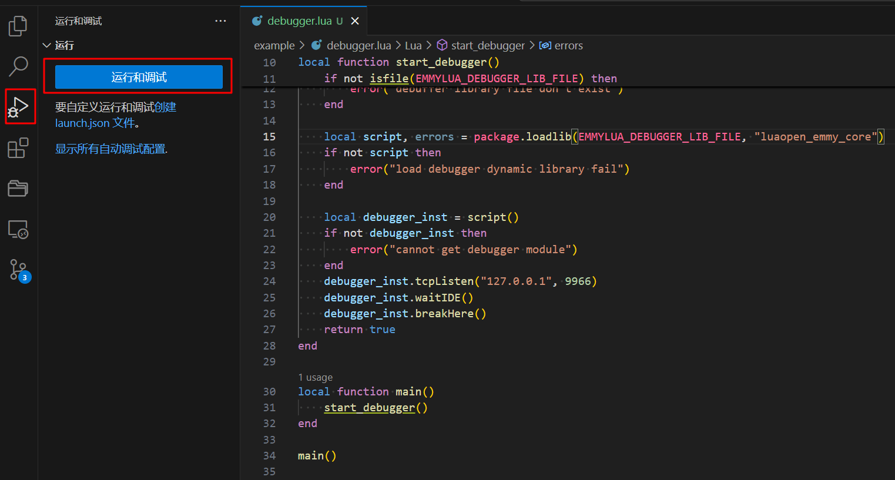
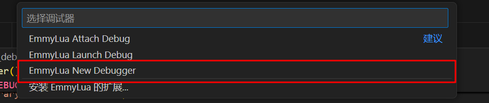

# Debug

## VSCode 调试

> 注意事项: 需要注意的是如果想用 emmylua 调试, 必须禁用 luajit。后续可以考虑一下看看能否修改 xmake-repo 里 emmylua-debugger 的 package 描述来支持 luajit。

安装 VSCode 的 EmmyLua 扩展：

> <https://github.com/EmmyLua/VSCode-EmmyLua>

正常情况下 xmake 的 Lua 脚本是在 `/usr/local/share/xmake` 下，而我们需要在该目录打断点。为了方便开发，我们希望在源码目录打断点，可以通过设置 `programdir` 实现：

```bash
# 设置 xmake 脚本目录为源码目录, 方便开发时调试
export XMAKE_PROGRAM_DIR="${XMAKE_SOURCE_DIR}/xmake"

# 此时查看 programdir 已经变化
$ xmake show
The information of xmake:
    version: 3.0.1+dev.51131a198
    host: linux/x86_64
    programdir: /home/cat/Documents/github/xmake/xmake
    programfile: /usr/local/bin/xmake
    globaldir: /home/cat/.xmake
    tmpdir: /tmp/.xmake1000/241111
    workingdir: /home/cat/Documents/github/xmake
    packagedir: /home/cat/.xmake/packages
    packagedir(cache): /home/cat/.xmake/cache/packages/2411
    gitsource: github.com
```

找个项目运行调试命令：

```bash
xrepo env -b emmylua_debugger -v -- xmake b -vrD
```

执行完上面的命令后脚本不会立即退出，而是会一直处于等待调试的状态，此时我们回到 xmake 源码仓库并切到 VSCode 的调试 Tab 页，点击 `RunDebug` （运行和调试） -> `Emmylua New Debugger` 就能连接到我们的 `lua` 命令调试器，开启调试。





## gdb 调试 xmake core

```bash
# xmake 运行时 coredump
$ xmake run -vD foo.unittest
Segmentation fault

# gdb 调试
$ gdb --args xmake run -vD foo.unittest
(gdb) r
(gdb) bt
```
