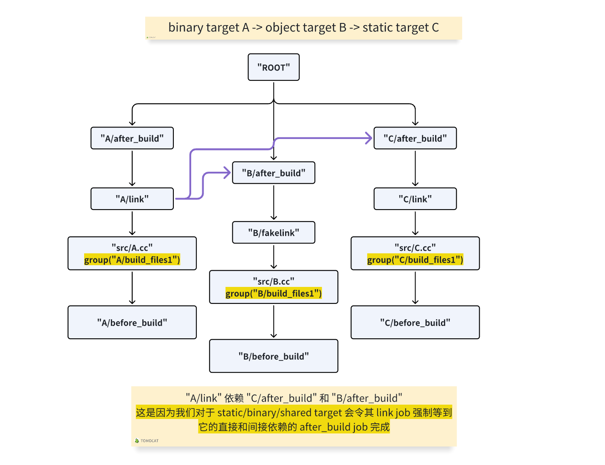

# README

## 背景

假设 binary target A 依赖 object target B，而 B 又依赖 static target C。

那么我们必须保证 A 的 `link` job 必须在 C 的 `link` job 后，否则可能出现 bug。

## 实现

```lua
function get_batchjobs(targetnames, group_pattern)

...

    -- make sure static/shared/binary target waits until all of it's direct and indirect
    -- dependent `afrer_build` tasks are compiled
    for _, target in ipairs(project.ordertargets()) do
        local target_kind = target:kind()
        local non_object_kind = target_kind == "static" or target_kind == "shared" or target_kind == "binary"
        local visited_deps = {}
        if non_object_kind then
            local root_job = build_jobs[target:name()]
            if root_job then
                _add_batchjobs_for_non_object_target(batchjobs, target, root_job, build_after_jobs, visited_deps)
            end
        end
    end

...

end
```

我们在构造了一棵尽可能并行的树后，对于非 object target，让它们的 `link` job 必须强制直接和间接依赖的 `after_build` job 完成。

最终其依赖图如下所示：


